# Reference App Structure: Live Stream Commerce App

This guide walks you through a live shopping reference app that uses the Agora Video and Real-time Messaging SDKs, as well as Firebase and several other open-source packages.

## Overview

The key features found in this repository:
- Customer login with Sign in with Apple.
- Merchant live stream sessions.
- Customers can see all currently live merchants.
- Customers can purchase with Apple Pay.
- Banuba face filters.

## Setup

A few pieces need to be in place to set up this project, as it uses a back-end service, as well as Apple features that need to be set up in your Apple Developer dashboard.

First, to open the project you'll need to run `pod install` while in the project root, alongside a file named `Podfile`, and then open the `LiveCommerce.xcworkspace` file.

### Agora Keys

Inside the AppKeys.swift file are a few placeholders for keys and tokens provided by Agora, Firebase, or Banuba.

For the first two Agora properties, you need to fetch a project key for the `agoraKey` property. Head to the [Agora Console](https://console.agora.io) to fetch one from an active project of yours, or create a new project via the console. As forr the `agoraTokenServer` property, that depends on your project type in the console. If you have an insecure project, then you do not need a token, and you can simply assign this to `nil`. If you have a secured application, you'll need to launch a token server. But don't worry, this is very simple, with multiple options for one-click deployable token servers:

https://github.com/AgoraIO-Community/agora-token-service

Once your token server is launched, add its URL to the `agoraTokenServer` property. The other properties are covered below.

### Firebase

You will need to set up a Firebase account for this application, where you provide the app's unique identifier. Head over to the excellent Firebase documentation to see how to do this:

https://firebase.google.com/docs/ios/setup

The Firebase components needed are real-time database (customer accounts, store products, orders), storage (images), and Sign in with Apple.

> Add the URL for your firebase instance to `databaseURL`.

When opening the project, you may notice a missing GoogleService-Info file. Just add the file provided by Firebase and you'll be good to go.

### Sign in with Apple

Setting up Sign in with Apple is quite simple, especially with Firebase's integration. To set it up with this application, check out this Firebase guide:

https://firebase.google.com/docs/auth/ios/apple

The docs also cover configuring Sign in with Apple on the Apple Developer dashboard.

### Apple Pay

Setting up Apple Pay has never been easier. This Apple guide shows all the steps necessary. If you have an active developer account with Apple, the process won't take long at all:

https://developer.apple.com/documentation/passkit/apple_pay/setting_up_apple_pay

### Banuba

Banuba is an Agora partner that has many face filters that integrate directly into our SDK. To set this up, go to the Agora Extensions homepage, fetch a token, and add it to the `banubaToken` property.

## Folder Structure
At a high level, the structure for  this live commerce iOS application consists of the following directories:

```
LiveCommerce/LiveCommerce
├── CustomerViews
├── MerchantViews
├── SharedViews
│   ├── OrderViews
│   └── ProductAndShows
├── AgoraPieces
├── DataConnections
├── Assets.xcassets
└── effects
```

### CustomerViews

The CustomerViews folder contains all the views related to the customer experience in the LiveCommerce application. This includes the user interface for browsing products, creating an account, and making purchases.

### MerchantViews

The MerchantViews folder contains all the views related to the merchant experience in the LiveCommerce application. This includes the user interface for managing products, processing orders, and tracking inventory.

### SharedViews

The SharedViews folder contains views that are shared between the customer and the merchant experiences. This includes views related to orders and products, the login view, and settings.

### SharedViews/OrderViews

The OrderViews folder in SharedViews contains views related to the ordering process, such as the view for showing a list of orders and the individual cells in that list.

### SharedViews/ProductAndShows

The ProductAndShows folder in SharedViews contains views related to browsing and viewing products, such as the product list page and the product detail page.

### AgoraPieces

The AgoraPieces folder contains all the code related to the integration of Agora's live streaming technology into the LiveCommerce application. This includes the video connections, signaling, and related functionality.

### DataConnections

The DataConnections folder contains all the code related to the data connections used in the LiveCommerce application. This includes connecting to a database to store and retrieve product and order information.

### effects

The effects folder contains the Banuba 3D face filter templates.

## User Flow Diagram

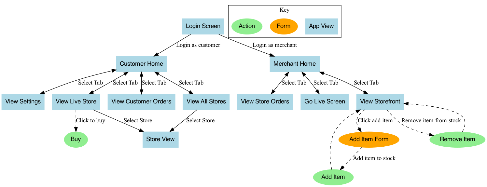

In this diagram, you can see that right from the start there are two main scenarios: a customer scenario and a merchant scenario.

The customer has the option to see live stores, their own orders, and all available stores. They also have the option to buy products from stores.

Merchants can see orders made on their store, view their storefront for actions such as updating stock, and live broadcast to all available customers.

## App Screens

| Customer Login | Merchant Login | No Stores Live | Stores Live |
|:-:|:-:|:-:|:-:|
| 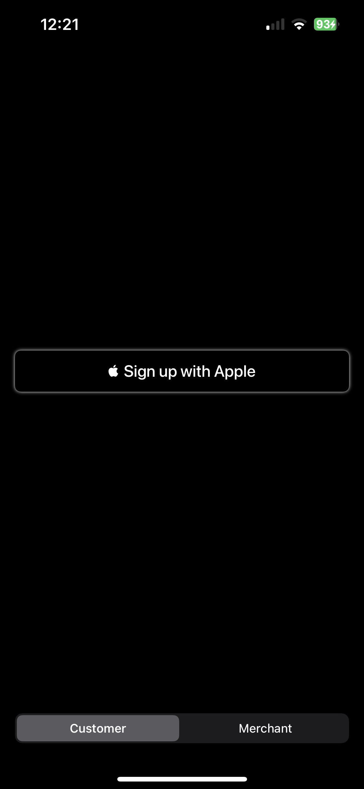 | 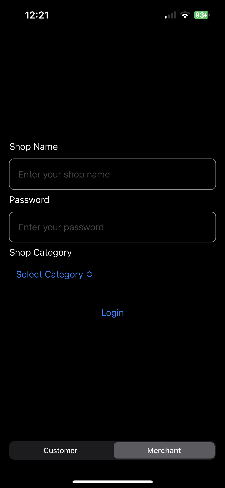 | 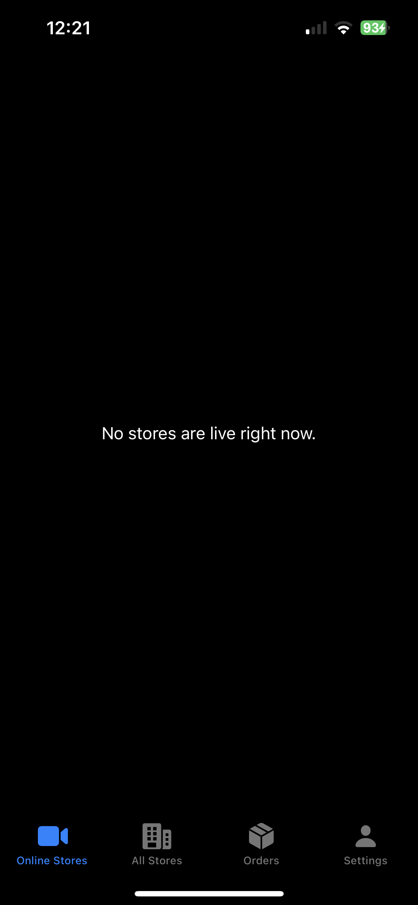 |  |

| All Stores | Storefront | Customer Orders Tab | Merchant Orders Tab |
|:-:|:-:|:-:|:-:|
| 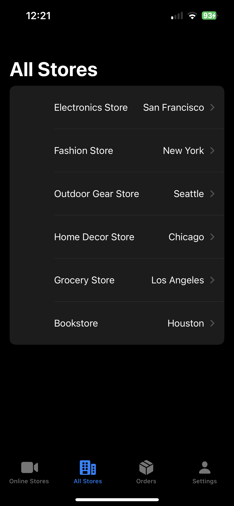 | 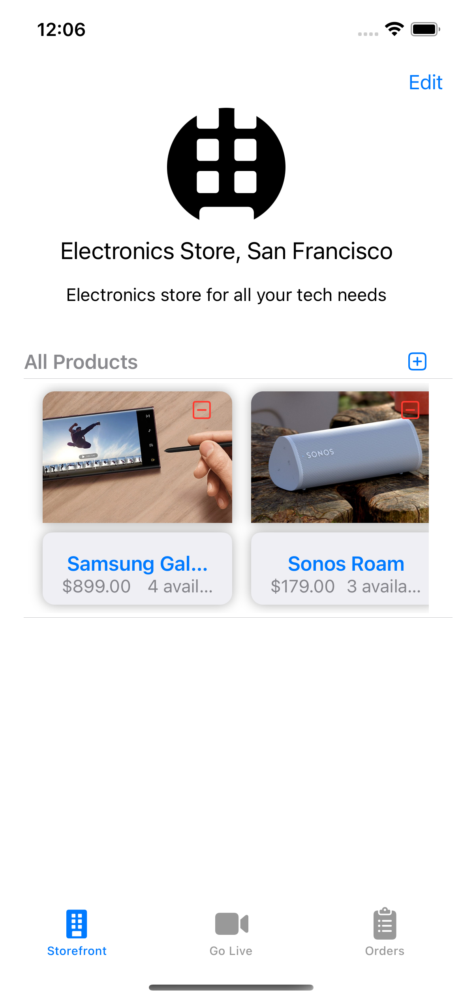 | 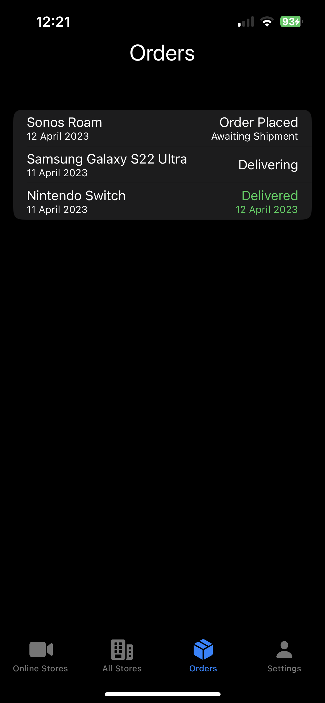 | 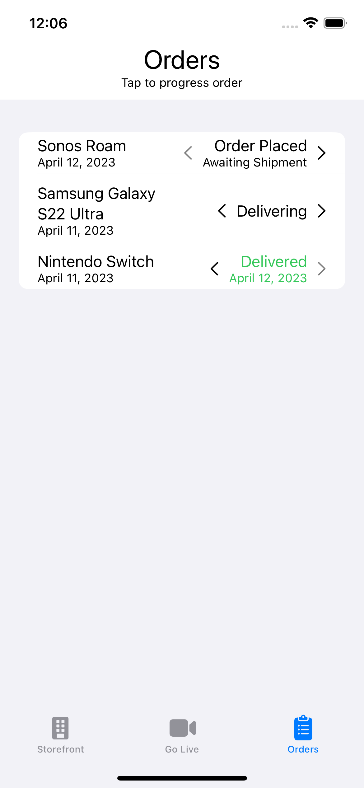 |

| Go Live View | Choose Product | Buy Product |
|:-:|:-:|:-:|
|  | 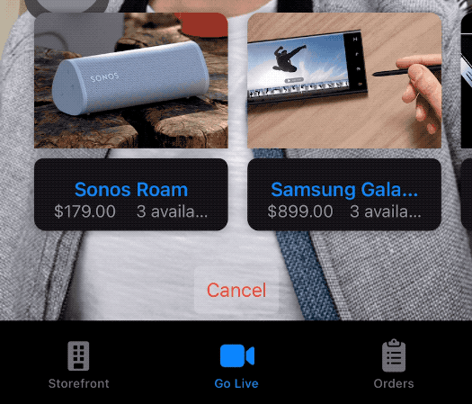 |  |

| Choose Filter | Banuba Filter |
|:-:|:-:|
| 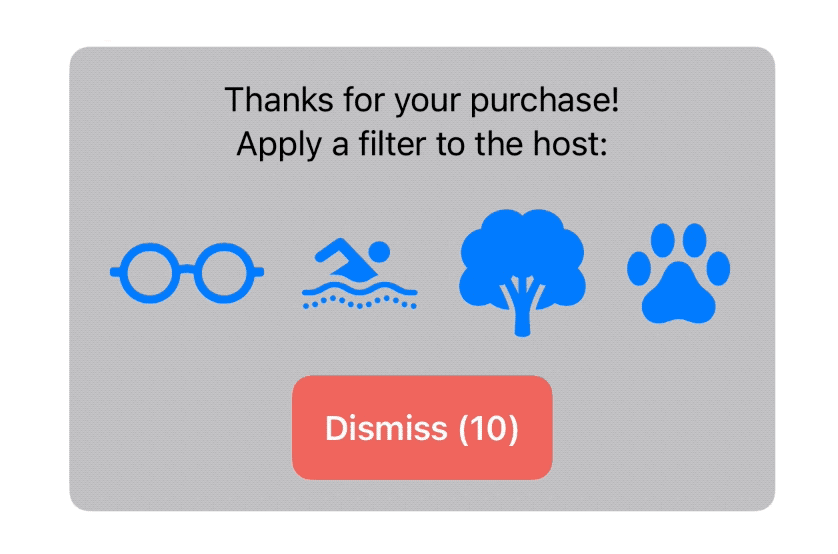 | 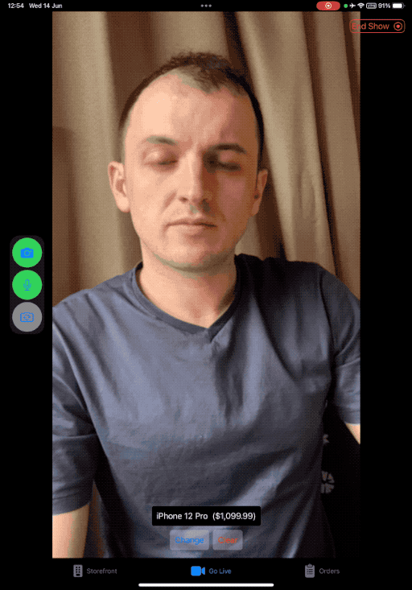 |

## Agora Overview

The [AgoraPieces](LiveCommerce/LiveCommerce/AgoraPieces) directory contains code related to the Agora SDK integration, which includes real-time audio and video communication functionality for the application, as well as code related to setting up Agora clients and handling various events relating to Agora functionality.

These are the files that can be found in the AgoraPieces directory:

```
AgoraPieces
├── AgoraView.swift
├── BanubaOptionsView.swift
├── StoreLiveFeedView.swift
├── LiveViewRepresentable.swift
└── RtmClient.swift
```

- [AgoraView.swift](LiveCommerce/AgoraPieces/AgoraView.swift): Defines the AgoraView, which is a `UIViewRepresentable` that is used to render the Agora Video SDK video streams in SwiftUI. Used in the customer scenario.
- [BanubaOptionsView.swift](LiveCommerce/AgoraPieces/BanubaOptionsView.swift): Defines the BanubaOptionsView, which is a `View` subclass that contains UI elements for configuring the Banuba Face AR SDK. This view appears in [StoreLiveFeedView.swift](LiveCommerce/AgoraPieces/StoreLiveFeedView.swift).  Used in the customer scenario.
- [StoreLiveFeedView.swift](LiveCommerce/AgoraPieces/StoreLiveFeedView.swift): Defines the StoreLiveFeedView, which is a SwiftUI `View`. This appears in the customer scenario for each store that is currently live. It contains an AgoraView, a BanubaOptionsView, and a LiveFeedBuyProductView.
- [LiveViewRepresentable.swift](LiveCommerce/AgoraPieces/LiveViewRepresentable.swift): Defines the LiveViewRepresentable, which is used to show the AgoraVideoViewer from the Agora Video UI Kit. LiveViewRepresentable is used by the merchant only when they are going live, as it also has controls to enable or disable the camera and microphone, etc.
- [RtmClient.swift](LiveCommerce/AgoraPieces/RtmClient.swift): Defines the RtmClient, which is a wrapper around the Agora Signaling SDK, that provides the logic for connecting and disconnecting to RTM channels, fetching tokens, and decoding received messages and performing actions based on them, such as displaying a Banuba filter or updating a store's live status.

## Agora Features

The following key Agora features are used in this application:

- Live video streaming
- Signaling (real-time messaging)
- Banuba face filters

The Agora features in this app are focused on the live broadcasting features. A merchant can start a channel and go live, while a customer can see which merchants are live and view their streams.

The backend only keeps track of orders, stock, and user profiles. So to know who is online at any given time, the Agora Signaling SDK (Real-time Messaging) SDK is also used. This enables us to have messages sent directly between devices, without having to go through our own backend (in this case, Firebase).

If you wanted to instead send these same messages to a server and have another client check for updates occasionally to see who's online, nothing prevents that. But for the real-time aspect, Signaling does a pretty good job.

### Live Video Streaming

There are two sides to live streaming: the broadcaster (merchant, in this case) and the audience (or customer).

The broadcaster's going live view can be found in GoLiveView.swift. This view uses the Agora Video UI Kit, which offers default buttons for toggling camera and microphone behaviours. A small button is presented at the top to switch from the preview state to live.

<p align="center">
    
</p>

The audience view for customers is OnlineStoresView.swift. This view is a collection of all the stores currently online. The user can swipe through the stores in a similar way to looking at photos in the photos app, and interact with the nested views (StoreLiveFeedView.swift), by navigating to their storefront, or purchasing the product they are currently selling.

### Signaling

In the same GoLiveView.swift that the merchant sees, customers can also select the product the merchant is currently selling. This action sends a message over the Agora Signaling SDK to let customers know the product ID of that item, which displays a card with basic information about the product. These messages are sent to the channel whenever the product updates, and they are sent directly to a specific customer whenever they join the live stream session.

<p align="center">
    
</p>

After a customer purchases a product through Apple Pay, a message is sent to the merchant to let them know who has purchased one of their products, and a small confetti animation appears.

All the signaling methods can be found in [RtmClient.swift](LiveCommerce/AgoraPieces/RtmClient.swift).

### Banuba Face Filters

After purchasing a product, the customer is presented with the choice of face filters to apply to the host. These face filters are provided by our extensions partner Banuba.

<p align="center">
    
</p>

Once an extension is selected, a message is sent over signaling directly to the merchant, notifying them of the face filter that has been selected.
The face filter is automatically applied to the merchant's camera feed, which is visible to all customers watching the live stream. After 10 seconds, the feed returns to normal.

<p align="center">
    
</p>

## Conclusion

Try out this repo, and feel free to adapt it with your own back-end systems using Agora's real-time tech!

If you have issues or questions, you can open an issue here. If there is a bug, we may not necessarily fix it, as this code is open source and should be used only as a reference to get you started with your real-time shopping applications.
