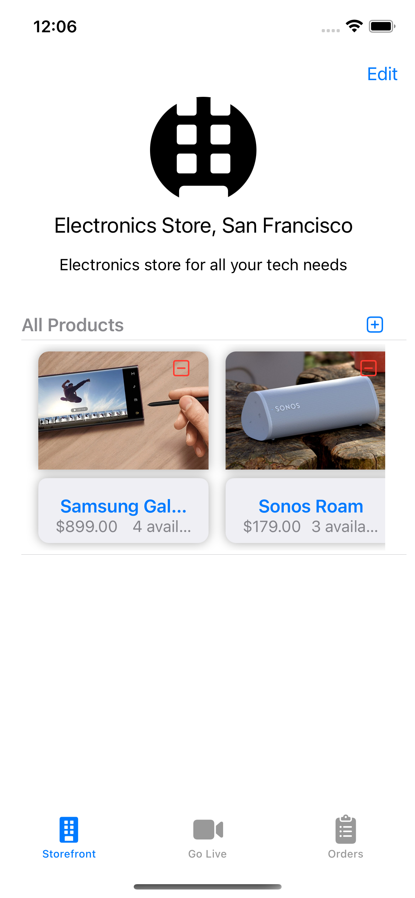

# Use-Case Driven Reference Design: Live Stream Commerce App

## Overview

The Live Stream Commerce App is a mobile application that allows customers to browse and purchase products from live streaming merchants. The app uses the company's video connection SDK to facilitate live streaming between the merchants and customers. This document outlines the high-level architecture and best practices for implementing the software system based on the identified use cases.

## Use Cases

### Use Case 1: Logging in as a Customer

#### Description

The user logs in as a customer using their Apple ID and can access the following tabs: live now, all stores, my orders, and settings.

#### Actors

- Customer

#### Pre-Conditions

- The user has a valid Apple ID.

#### Post-Conditions

- The user is logged in as a customer and can access the app's features.

#### Flow of Events

1. The app presents a login screen with options for "customer" or "merchant" on start-up.
2. The customer selects "customer" and logs in using their Apple ID.
3. The app displays the customer's available tabs: live now, all stores, my orders, and settings.

### Use Case 2: Logging in as a Merchant

#### Description

The user logs in as a merchant using their store's credentials and can access the following tabs: available products/stock, start live stream, and store settings.

#### Actors

- Merchant

#### Pre-Conditions

- The user has valid store credentials.

#### Post-Conditions

The user is logged in as a merchant and can access the app's features.

#### Flow of Events

The merchant opens the app and clicks on the "login" button.
1. The app presents a login screen with options for "customer" or "merchant" on start-up.
2. The merchant selects "merchant" and logs in using their store's credentials.
3. The app displays the merchant's available tabs: available products/stock, start live stream, and store settings.

### Use Case 3: Browsing Live Stores

#### Description

The user can browse all live stores currently streaming.

#### Actors

- Customer

#### Pre-Conditions

- The user is logged in as a customer.

#### Post-Conditions

- The user can view all live stores and interact with them.

#### Flow of Events

1. The customer selects the "live now" tab.
2. The app displays all live stores currently streaming.
3. The customer selects a live store to view.

#### Alternative Flows

- If no stores are currently live streaming, the app will display a message indicating that.

### Use Case 4: Browsing All Stores

#### Description

The user can browse all stores in the app's database.

#### Actors

- Customer

#### Pre-Conditions

- The user is logged in as a customer.

#### Post-Conditions

- The user can view all stores and interact with them.

#### Flow of Events

1. The customer selects the "all stores" tab.
2. The app displays all stores in the database.
3. The customer selects a store to view.

#### Alternative Flows

- If no stores are available in the database, the app will display a message indicating that.

### Use Case 5: Purchasing a Product

#### Description

The user can purchase a product from a live store using Apple Pay.

#### Actors

- Customer

#### Pre-Conditions

- The user is logged in as a customer.
- The live store is currently streaming.
- The product is available for purchase.

#### Post-Conditions

- The product is purchased and added to the customer's order history.

#### Flow of Events

1. The customer selects a product available for purchase.
2. The customer selects "buy" and is directed to Apple Pay.
3. The customer completes the transaction.
4. The app confirms the purchase and adds the product to the customer's order history.

#### Alternative Flows

- If the product is not available for purchase, the app will display a message indicating that.

### Use Case 6: Applying a Banuba Filter

#### Description

The customer can select a Banuba filter to be applied to the live stream for a duration of 10 seconds.

#### Actors

- Customer

#### Pre-Conditions

- The user is logged in as a customer.
- The customer has purchased a product from the live store.

#### Post-Conditions

- The Banuba filter is applied to the live stream for 10 seconds.

#### Flow of Events

1. The customer selects a purchased product from their order history.
2. The app displays the live stream with the selected product featured.
3. The customer selects a Banuba filter to be applied to the live stream for 10 seconds.
4. The app applies the selected Banuba filter to the live stream for 10 seconds.

### Use Case 7: Starting a Live Stream

#### Description

The merchant can start a live stream to showcase their products.

#### Actors

- Merchant

#### Pre-Conditions

The user is logged in as a merchant.

#### Post-Conditions

The merchant is live streaming and can showcase their products.

#### Flow of Events

1. The merchant selects the "start live stream" tab.
2. The app prompts the merchant to start the live stream.
3. The merchant starts the live stream.

### Use Case 8: Managing Products/Stock

#### Description

The merchant can manage their available products/stock.

#### Actors

- Merchant

#### Pre-Conditions

The user is logged in as a merchant.

#### Post-Conditions

The merchant can manage their available products/stock.

#### Flow of Events

1. The merchant selects the "manage products" tab.
2. The app displays the merchant's available products/stock.
3. The merchant can add, remove, or edit products/stock.

### Use Case 9: Changing Store Settings

#### Description

The merchant can change their store's settings.

#### Actors

- Merchant

#### Pre-Conditions

The user is logged in as a merchant.

#### Post-Conditions

The merchant can change their store's settings.

#### Flow of Events

1. The merchant selects the "store settings" tab.
2. The app displays the store's settings.
3. The merchant can edit their store's information.

## System Architecture

The software system is designed using a layered architecture that separates the presentation, business logic, and data access layers as much as possible.

### Layer 1: Presentation Layer

The presentation layer consists of the user interface components that the customer and merchant interact with.

### Layer 2: Business Logic Layer

The business logic layer will handle the app's core functionality, such as managing orders and live streams.

### Layer 3: Data Access Layer

The data access layer will manage the app's interaction with the company's video connection SDK. The data access layer mostly communicates with the Firebase database, as well as Agora RTM for data messaging between devices.

## User Interface Design

The user interface design will be simple, intuitive, and visually appealing. The user interface will be designed based on the identified use cases to ensure that it meets the user's needs and requirements.

### Screen 1: Login Screen

| Customer Login | Merchant Login |
|:-:|:-:|
|  |  |

### Screen 2: Live Now Tab

| No Stores Live | Stores Live |
|:-:|:-:|
|  |  |

### Screen 3: All Stores Tab

| Store |
|:-:|
|  |

### Screen 4: Orders Tab

| Customer Orders Tab | Merchant Orders Tab |
|:-:|:-:|
|  |  |

### Screen 5: Settings Tab
...

### Screen 6: Manage Products Tab

| Store |
|:-:|
|  |

### Screen 7: Start Live Stream Tab
...

## Conclusion

The Use-Case Driven Reference Design provides a solid foundation for developing a live stream commerce app that meets the user's needs and requirements. By modeling the use cases, the software developers can identify the system's functional requirements, which they can use to design the software architecture and develop the system features. The design approach ensures that the software system is developed based on user needs and goals, and it can also help to improve software quality, maintainability, and scalability.

